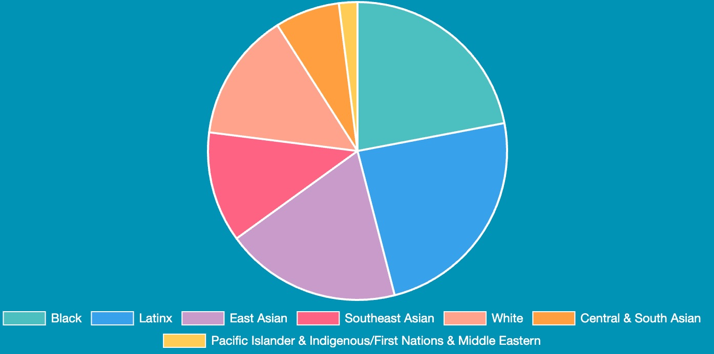

# Techtonica

This repo is for [the Techtonica website](http://techtonica.org), which is
currently hosted on DreamHost.

- [Techtonica](#techtonica)
  - [Who](#who)
  - [What](#what)
  - [How](#how)
  - [Getting Started](#getting-started)
    - [Set Up Virtual Environment](#set-up-virtual-environment)
    - [Install pip Version 23](#install-pip-version-23)
    - [Install and Upgrade pip-tools](#install-and-upgrade-pip-tools)
    - [Install Pre-Commit Hooks](#install-pre-commit-hooks)
    - [Install Requirements](#install-requirements)
    - [Create Config.ini File](#create-configini-file)
    - [Running Locally](#running-locally)
    - [Using Docker to Run Locally](#using-docker-to-run-locally)
      - [First Time Using Docker?](#first-time-using-docker)
      - [For Docker Pros](#for-docker-pros)
    - [CSS / SCSS](#css--scss)
    - [Alt-Text Guidelines](#alt-text-guidelines)
    - [Square Testing](#square-testing)
      - [Setup](#setup)
      - [Running Locally](#running-locally-1)
    - [Updating the Demographics Chart for the Apply Section](#updating-the-demographics-chart-for-the-apply-section)
    - [Updating Testimonials](#updating-testimonials)
    - [Updating Dependencies](#updating-dependencies)
  - [Deployment to DreamHost](#deployment-to-dreamhost)
    - [Initial Setup](#initial-setup)
    - [Deploy Feature Branch](#deploy-feature-branch)
    - [Updating the Site](#updating-the-site)

## Who

The audience of the website is made up of (potential) volunteers, sponsors, and program participants.

## What

We need to effectively communicate that Techtonica and its participants are worth supporting and share details of the program for potential applicants and volunteers.

## How

There should be a good understanding of how the program works with vetting, training, mentoring, and placements.

[Detailed instructions on how to update the website](https://docs.google.com/document/d/1oL3BaemFfUD7DfoFzhTSwcX4lPxYbWN3Dy9oZFfGP0Y/edit)

## Getting Started

You need Python version 3.8.10 and pip version 23 in order to properly update dependencies and replicate the production server environment locally.

Using Python 3.8.10 and pip 23 helps ensure compatibility and consistency between your local development environment and the server environment. This minimizes potential issues during deployment by keeping dependencies in sync with the versions expected by the servers and eliminates discrepancies caused by different versions, ensuring that code runs the same way on every developer's machine.

### Set Up Virtual Environment

It is recommended you use a virtual environment to keep dependencies
required by different projects separate. [Learn more about Python virtual
environments](http://docs.python-guide.org/en/latest/dev/virtualenvs/).

Set up virtual environment with Python 3.8.10 and Pip 23 using [pyenv](https://github.com/pyenv/pyenv) and [venv](https://docs.python.org/3/library/venv.html):

```
# Install pyenv using brew
brew install pyenv
# Use pyenv to install version python 3.8.10
pyenv install 3.8.10
# Set your python version to 3.8.10
pyenv local 3.8.10
# Create a virtual environment using venv
python -m venv venv
# Activate your new virtual environment
source venv/bin/activate
```

**Note: if you are running into an error with running `python -m venv venv` you may need to instead use the full path to the python executable when creating your virual environment. An example is `/Users/yourPCName/.pyenv/versions/3.8.10/bin/python -m venv venv`**

### Install pip Version 23

Ensure you are running pip23 to match the version on the servers:

```
pip install --upgrade pip==23.0
```

### Install and Upgrade pip-tools

```
python -m pip install -U pip-tools
```

### Install Pre-Commit Hooks

This project uses various pre-commit hooks to ensure code quality and formatting
consistency.

1. [`Install pre-commit`](https://pre-commit.com/#install) globally.
1. Install the project pre-commit hooks:

```
pip install pre-commit
pre-commit install -f --install-hooks
```

### Install Requirements

```
pip install -r dev.txt
```

### Create Config.ini File

```
touch config.ini
```

And then copy and paste this code into your new file (note: For the actual values, please see [Updating Techtonica's Website](https://docs.google.com/document/d/1oL3BaemFfUD7DfoFzhTSwcX4lPxYbWN3Dy9oZFfGP0Y/edit?tab=t.0)):

```sh
   [default]
   # Acceptable values are sandbox or production
   environment = sandbox
   dev_password = dev_password

   [production]
   square_application_id = production_application_id
   square_access_token = production_access_token
   square_location_id = production_location_id

   [sandbox]
   square_application_id = <sandbox app id>
   square_access_token = <sandbox access token>
   square_location_id = <sandbox location id>

   [slack]
   slack_webhook =  <slack webhook>
```

### Pre-Commit Hooks Guide

To manually run, test, and upgrade pre-commit hooks locally, follow these steps:

To run hooks on specific files, use the command:

```
pre-commit run --files <file1> <file2>
```

For example, if you want to test a single file, you can use

```
pre-commit run --files main_site.py
```

To run all hooks on every file in the repository, use the
command

```
pre-commit run --all-files
```

If you need to upgrade your hooks to their latest versions, run

```
pre-commit autoupdate
```

After upgrading, ensure you reinstall the hooks by running

```
pre-commit install
```

### Running Locally

Each time you want to work on your code, you will need to activate your virtual environment and run the server locally. You do not need to do any of the setup instructions again (besides installing requirements, if those have changed).

[If you prefer using Docker, see instructions](#using-docker-to-run-locally).

Activate your virtual environment:

```
source venv/bin/activate
```

Install any requirements if they've changed:

```
pip install -r dev.txt
```

Start the application's server:

```sh
FLASK_DEBUG=1 FLASK_APP=main_site.py flask run
```

Browse to <http://localhost:5000>.

### Using Docker to Run Locally

#### First Time Using Docker?

1. Download [Docker Desktop](https://www.docker.com/products/docker-desktop)
1. `cd` into the folder that holds your techtonica.org repo
1. Run your app: `docker-compose up`

⚠️ _When there are updates to `requirements.txt` or `Dockerfile`, you will have to
rebuild the Docker image in order for those changes to take effect._

#### For Docker Pros

- To run app: `docker-compose up`
- To rebuild Docker image: `docker build . -t techtonica/website --pull`
- To push latest image to Docker Hub: `docker push techtonica/website`

### CSS / SCSS

The Techtonica website uses Sass to manage it's CSS.

Styling changes should **only** be made to the Sass (.scss) files and then compiled to
CSS using one of the following commands:

👷‍♀️ Install Sass using one of the following

Mac: `brew install sass/sass/sass`

Windows: `choco install sass`

To compile your Sass files to CSS and to keep track of changes in real-time.

```sh
sass static/sass/style.scss static/css/style.css
sass --watch static/sass/style.scss static/css/style.css
```

By running the --watch command, any modifications made to the CSS files are instantly reflected, saving you time and ensuring your styles are always up-to-date.

### Alt-Text Guidelines

To ensure accessibility for all users, alt-text on our site should follow these best practices:

- Avoid line breaks, as they disrupt screen readers and negatively impact user experience.
- Keep alt-text under 125 characters to ensure full readability.
- Refrain from using emojis, as their descriptions can vary across platforms and may confuse screen reader users.
- Similarly, avoid special characters unless essential, as they can be misinterpreted or skipped by assistive technologies.
- Alt-text should be descriptive, concise, and context-aware, avoiding redundancy with nearby text.

For more detailed guidelines and examples, refer to the [Alt-Text Wiki](https://github.com/Techtonica/techtonica.org/wiki/Alt%E2%80%90Text-Guidelines).

### Square Testing

There are features on the site that use Square for payments and will periodically need testing (especially if their libraries get updated). Currently this is only the "Post a Job" page.

#### Setup

1. Secrets required for the Square payment API and Slack webhook are stored in a config.ini file in the root directory of our repository.
2. This file is listed in our .gitignore file and will not be included when pushing or pulling updates.
3. You will need to manually add it into your local repository to test these features locally, and will also need to manually add it into whatever Dreamhost server (testing, staging, or production) that you are using as well, if it’s not already there.
4. BE CAREFUL ABOUT environment VALUE! If it’s set to production it will actually charge the cards you test with, so be sure to set it to sandbox when testing locally or on staging or testing.
5. Please see the [Updating Techtonica's Website](https://docs.google.com/document/d/1oL3BaemFfUD7DfoFzhTSwcX4lPxYbWN3Dy9oZFfGP0Y/edit?tab=t.0) doc to get the keys and secrets.

#### Running Locally

Run your server using the following command, it will bypass any HTTPS cert errors.

```sh
pip install pyopenssl
FLASK_DEBUG=1 FLASK_APP=main_site.py FLASK_RUN_CERT=adhoc flask run
```

When navigating to the site, if your browser pops up an HTTPS insecure warning, click "Advanced" and "[Proceed to 127.0.0.1 (unsafe)](chrome-error://chromewebdata/#)"


Navigate to one of the pages that uses Square, currently "Post a Job".

Follow the instructions on the page, and when instructed to enter a credit card number, use one of the following numbers found [here](https://developer.squareup.com/docs/devtools/sandbox/payments).

### Updating the Demographics Chart for the Apply Section



At the moment, we do not have styling in place that will enable us to have a coded, adequately sized piechart while still maintaining mobile responsiveness. Until that happens, here is how to update the piechart when numbers change.

1. Start the server.
2. Open the browser and navigate to the Apply page.
3. Update the `data` section in `static/js/piechart.js#L30`.
4. Uncomment out following in `full-time-program.html`.

```
  <!-- <div class="blue-background">
     <canvas id="myChart" width="700" height="350"></canvas>
  </div> -->
```

5. Take a screenshot of the piechart on the rendered page.
6. Add the screenshot to the `static/img` directory saved with YEAR-H#-Cohort-Demographics.jpg, ex. 2023-H1-Cohort-Demographics.jpg.
7. Update `full-time-program.html` to point to the new image you just added. Update the alt text if necessary.

```
 
```

8. Re-comment the following.

```
  <!-- <div class="blue-background">
     <canvas id="myChart" width="700" height="350"></canvas>
  </div> -->
```

9. Stop the server
10. Commit your code and open a pull request

### Updating Testimonials

To update and add testimonial images, follow these steps:

1. Upload your testimonial image to Canva, crop it as needed, and download it as a `.png`.
2. The image name should follow this format: `Platform-FirstName-Topic-Year-min.png` (e.g., `Linkedin-Daamiah-Techtonica-2025-min.png`).
3. Use [ImageOptim](https://imageoptim.com/mac) to compress the image for better web performance.
4. Save the optimized image in the `techtonica.org/static/img/testimonials` folder within the repository to maintain consistency and easy access.

For detailed instructions, visit the [full guide on the Wiki](https://github.com/Techtonica/techtonica.org/wiki/How-to-Add-and-Optimize-Testimonial-Images).

### Updating Dependencies

This project uses [pip-tools](https://github.com/jazzband/pip-tools) to manage
dependencies. _If there are dependencies only needed for local development, these go in dev.in/dev.txt. Otherwise they go in requirements.in/requirements.txt_. If you need to add or remove a Python library dependency:

1. Edit `requirements.in` or `dev.in` (referred to below as `file_name.in`)
1. Generate the .txt file

   ```sh
   pip-compile -U <file_name.in>
   pip install -r <file_name.txt>
   ```

## Deployment to DreamHost

### Initial Setup

The below instructions are for setting up a new server in DreamHost.

1. Follow the instructions in the [Setting up and deploying Python Flask to
   Dreamhost](https://mattcarrier.com/flask-dreamhost-setup/) blog post.

1. Update package tools, while you're still operating in the virtual
   environment:

   ```sh
   pip install -U pip setuptools pip-tools
   ```

1. Create a `config.ini` file in the root directory of the repo in whichever Dreamhost server if there isn't one already present, and populate it with the necessary keys.

   ```sh
   [default]
   # Acceptable values are sandbox or production
   environment = sandbox
   dev_password = dev_password

   [production]
   square_application_id = production_application_id
   square_access_token = production_access_token
   square_location_id = production_location_id

   [sandbox]
   square_application_id = <sandbox app id>
   square_access_token = <sandbox access token>
   square_location_id = <sandbox location id>

   [slack]
   slack_webhook =  <slack webhook>
   ```

### Deploy Feature Branch

The below instructions describe how to deploy your feature branch once it has been tested and your PR has been approved. Make sure your feature branch was branched off of develop.

1. Push changes to feature branch

1. Merge feature branch into develop

1. Push develop to GitHub

1. Delete feature branch

1. Deploy develop to staging

1. Merge develop into main

1. Push main to GitHub

1. Deploy main to techtonica.org

1. Tag the date after deployment

### Updating the Site

Important: Only ever Pull from the server! There are currently 3 main servers in use: "staging", "techtonica.org" and "testing".

1. Log in via SSH using your SSH key.

1. Change directory to the appropriate domain:

   ```sh
   cd techtonica.org
   ```

   or

   ```sh
   cd staging.techtonica.org
   ```

1. Activate the virtual envrionment:

   ```sh
   . bin/activate
   ```

1. Change to the source directory:

   ```sh
   cd techtonica
   ```

1. Pull the latest code using

   ```sh
   git pull
   ```

1. Update requirements:

   ```sh
   pip-sync
   ```

1. "Restart" the server to showcase new changes

   ```sh

   # staging.techtonica.org
   systemctl --user stop gunicorn_staging
   systemctl --user enable gunicorn_staging
   systemctl --user restart gunicorn_staging
   systemctl --user status gunicorn_staging

   # testing.techtonica.org
   systemctl --user stop gunicorn_testing
   systemctl --user enable gunicorn_testing
   systemctl --user restart gunicorn_testing
   systemctl --user status gunicorn_testing

   # techtonica.org
   systemctl --user stop gunicorn_techtonica
   systemctl --user enable gunicorn_techtonica
   systemctl --user restart gunicorn_techtonica
   systemctl --user status gunicorn_techtonica

   ```

1. Deactivate virtual environment and exit server:

   ```sh
   deactivate
   ```

   ```sh
   exit
   ```

[def]: static/img/2023-H1-Cohort-Demographics.jpg
